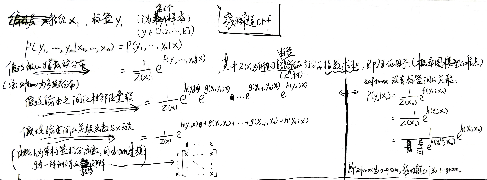
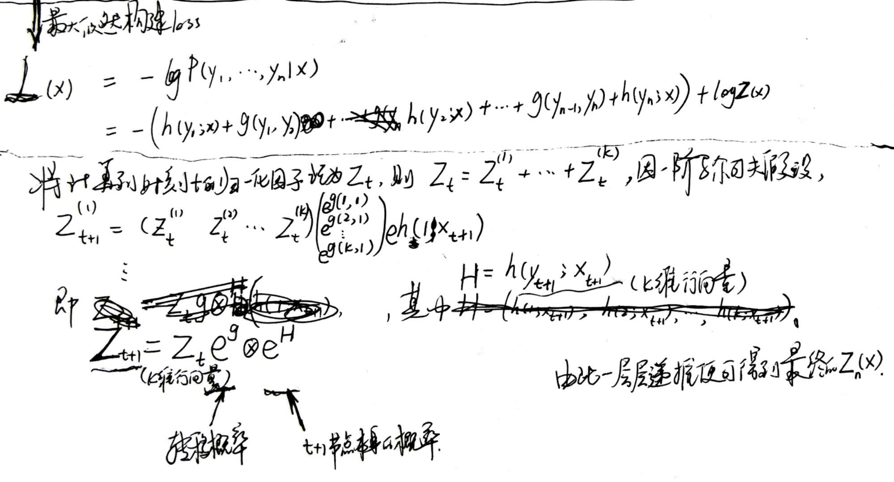

## 前言

条件随机场是给定一组输入随机变量条件下另一组输出随机变量的条件概率分布模型，其特点是假设输出随机变量构成马尔可夫随机场。

对于有上下文关联的**序列标注**任务：用softmax的话是不考虑输出层面的上下文关联，而是把这些关联放到编码层面；用crf的话是将关联分离到输出层面，使模型学习更加容易（引入输出的关联，还不仅仅是 crf 的全部，crf 的真正精巧的地方，是它以路径为单位，考虑的是路径的概率）。

逐帧 softmax 和 CRF 的根本不同：前者将序列标注看成是 n 个 k 分类问题，后者将序列标注看成是 1 个 k^n 分类问题。

## [线性链CRF](<https://www.jiqizhixin.com/articles/2018-05-23-3>)

线性链CRF模型如下：

其中转移矩阵称为[特征函数](<https://www.imooc.com/article/27795>)，为数据的先验知识，也可以用数据训练得到。特征函数的结果可以看作单标签打分函数（此处为任意的相邻两个）的权重。

模型loss为：

模型构建完成后，在输出端也是一个从 k^n 条路径中选最优的问题，**因为一阶马尔可夫假设的存在，它可以转化为一个动态规划问题**，用 viterbi 算法解决，计算量正比于 n。

### 与softmax、HMM对比

## denseCRF

softmax无法对像素点类别之间的关系进行建模（即每一个图像像素点的类别都有可能和临近点的类别相近），为对对像素点类别之间的关系建模提出denseCRF，如下：

其中二元势函数就是描述像素点与像素点之间的关系，鼓励相似像素分配相同的标签，而相差较大的像素分配不同标签，而这个“距离”的定义与颜色值和实际相对距离有关。因为二元势函数描述的是每一个像素与其他所有像素的关系，所以叫“全连接”。具体公式如下：

[ref 1: 以RNN形式做CRF后处理—CRFasRNN](<https://blog.csdn.net/hacker_long/article/details/89642673>)

[ref 2: 图像语义分割之FCN和CRF](<https://blog.csdn.net/u012759136/article/details/52434826>)

## CRFasRNN

## G-CRF

## MRF

