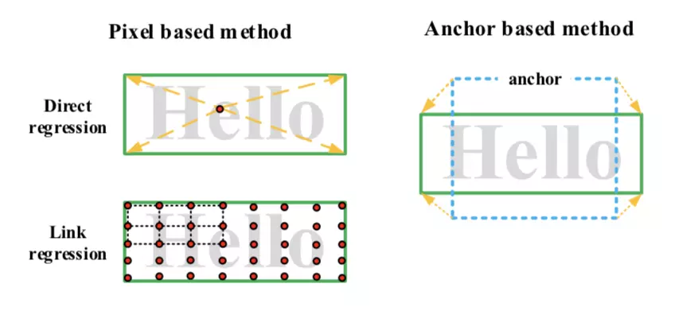

文字检测主要有两大困难：密集文本行和长文本。已有的应对方法如下：

* 密集文本行：
  * 将文本边界设为第三类；
  * 对文本框GT做pre-process（shrink）；
  * textMountain;

* 长文本：
  * 用post-process的方法使得长文本可以化为多个等宽的短文本，从而只预测文本的高度（[CTPN](<https://github.com/eragonruan/text-detection-ctpn>)）；
  * （[Advanced-EAST](<https://github.com/huoyijie/AdvancedEAST>)）

文字检测主要两大类方法：anchor-based和pixel-based。

* anchor-based数据成本低，但很依赖anchor的精心设计，需尽可能的覆盖所有的文本尺度。
* pixel-based对小目标分割具有一定的优势，对于长文本（direct regression）或者较大文本（link regression）容易出现检测不全或者丢失的情况。

