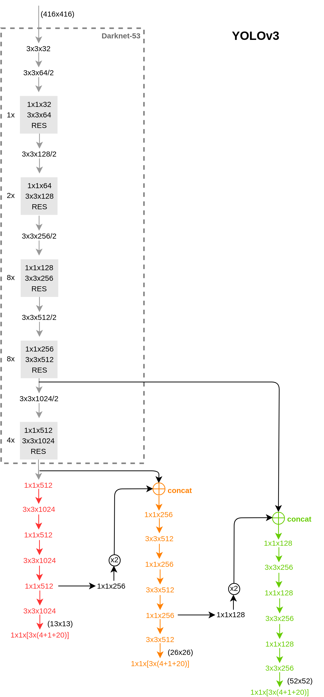

# 预备知识

## 图像特性

图像具有 translation invariance（平移不变性）和 scale invariance（尺度不变性），这也是神经网络在图像领域应用时需要遵循的两大前提。

## [NMS](https://blog.csdn.net/shuzfan/article/details/50371990)(Non-Maximum Suppression)非极大值抑制

NMS 将同类别的检测框按得分排序，然后保留得分最高的框，同时删除与该框重叠面积大于一定比例的其它框，由此迭代。

具体为，首先选定一个 IoU（Intersection-over-Union，交并比，即两框重叠部分面积占两框并集面积的比例，**用于衡量两个 bounding box 重叠度的量**）阈值，例如 0.25，然后将所有 4 个窗口（bounding box）按照得分由高到低排序，然后选中得分最高的窗口，遍历计算剩余的3个窗口与该窗口的交并比（IoU），如果 IoU 大于阈值 0.25，则将窗口删除；然后再从剩余的窗口中选中一个得分最高的。重复上述过程，直至所有窗口都被处理，从而得到所有的检测框。示例代码如下：

```python
def py_cpu_nms(dets, thresh):
    x1, y1, x2, y2, scores = dets[:, 0], dets[:, 1], dets[:, 2], dets[:, 3], dets[:, 4]
    areas = (x2 - x1 + 1) * (y2 - y1 + 1)
    order = scores.argsort()[::-1]

    keep = []
    while order.size > 0:
        i = order[0]
        keep.append(i)
        order = order[1:]
        xx1 = np.maximum(x1[i], x1[order])
        yy1 = np.maximum(y1[i], y1[order])
        xx2 = np.minimum(x2[i], x2[order])
        yy2 = np.minimum(y2[i], y2[order])

        w = np.maximum(0.0, xx2 - xx1 + 1)
        h = np.maximum(0.0, yy2 - yy1 + 1)
        inter = w * h
        ovr = inter / (areas[i] + areas[order] - inter)
        inds = np.where(ovr <= thresh)[0]
        order = order[inds]

    return keep
```

这种方法有两个弊端，一方面IoU阈值不易确定，另一方面两个IoU过大的同类别物体的检测框会被抑制掉。	

目前常用的解决方案为[soft-NMS](https://github.com/bharatsingh430/soft-nms) ，其思想为不直接删除所有IoU大于阈值的框，而是将以IoU为因变量的权重（paper给出了线性加权和高斯加权两种形式）作用在目标框的得分上；即目标框的IoU越大，其得分下降得就越厉害，反之同理。将soft-NMS（以线性加权为例）与NMS实现方面的差异表示如下：
$$
s_i = \{^{s_i, \quad \quad \quad \quad \quad \mathrm{iou}(M,b_i) < threshold}
	_{0, \quad \quad \quad \quad \quad \mathrm{iou}(M,b_i) \ge threshold} ,
\\
s_i = \{^{s_i, \quad \quad \quad \quad \quad \mathrm{iou}(M,b_i) < threshold}
	_{s_i(1-\mathrm{iou}(M,b_i)), \quad \mathrm{iou}(M,b_i) \ge threshold} .
$$
由此也可看出，若想改进为解决某一问题却导致了另一问题产生的原始算法，须得从算法的具体实现着手，步步分析，找到导致新问题产生的实现方面的原因。


## [ROIs Pooling](https://blog.csdn.net/zj360202/article/details/78845601)（Region of Interest Pooling）

做 ROIs Pooling，即对每个 ROI 做同等份数的分割（像素点个数不够的做插值），对每块分割做 max/avg pooling，即将映射到的 feature map 下采样（或上采样）为大小固定的 feature 。这样便无须训练不同尺度的大量分类器（因为分类器的输出层为一全连接层），而只用一个分类器便可。

分割（或插值）成的份数一般根据数据集中中等大小物体的尺度来确定，以尽量不打破 backbone 的平移不变性。如 VOC 数据集，中等大小物体尺度为 150 * 150，若检测框架的 stride 为 16，则设置 RoI-pooling 大小为 9.375 * 9.375 左右，如 Faster-R-CNN 采用的是 7 * 7 。不过这个问题已通过 R-FCN 解决了。

## bounding box regression

假设：当候选框与 GT 相差较小时，候选框内的 feature map 到两个平移量和两个尺度因子的映射是一种线性变换。该假设类似于人看到一本书的70%以上时，便能猜测出该书有多大，但若只看到一个书角便不能，当然也不期望能。


便于回归的两个trick（属于 target engineering，右上角标 * 的意味 target）：

1. 中心点平移时，用平移量是原proposal 宽和高的倍数做目标，保证了在候选框内有用的 feature map 含义相同时，候选框的大小对回归量的值影响不大（应对多尺度，即对尺度不变性的建模）；
2. 尺度放缩时，用尺度缩放因子取对数做目标，从而使得误差更符合高斯分布，否则单用尺度缩放因子做目标是[重尾分布](http://www.voidcn.com/article/p-kkmwhkpp-bgx.html)，无法用线性回归建模。

$$
t_x^* = (x^*-x_{proposal})/w_{proposal},
\\
t_y^* = (y^*-y_{proposal})/h_{proposal},
\\
t_w^* = \log (w^*/w_{proposal}),
\\
t_h^* = \log (h^*/h_{proposal}).
$$

回归次数越多（如[AttentionNet](http://image-net.org/challenges/talks/lunit-kaist-slide.pdf)），定位自然也会越精确，但通用框架通常都只采用一次回归的方案。

## selective search

首先通过过分割的方法将图片分割成无数个小区域，然后依据相似度（颜色、纹理、尺度、交叠度等）合并可能性最高的两个区域，重复合并，直至所有区域合并成为一个区域为止，最后输出所有曾出现过的区域作为候选区域（通常约为 2000 个）。如下图所示：


## [迁移学习](https://blog.csdn.net/SusanZhang1231/article/details/73249978)

迁移学习研究如何将已有模型应用到新的不同的、但是有一定关联的领域中。


* 迁移学习的核心问题是，找到两个领域的相似性。在实际应用中，找到合理的相似性，并且选择或开发合理的迁移学习方法，能够避免负迁移现象。随着研究的深入，传递迁移学习已经越来越成为解决负迁移的有效思想和方法。
* 领域自适应问题是迁移学习的研究内容之一，它侧重于解决特征空间一致、类别空间一致，仅特征分布不一致的问题。协方差漂移指数据的边缘概率分布发生变化。领域自适应研究问题解决的就是协方差漂移现象。


### 基础知识

领域主要由两部分组成：数据，和生成这些数据的概率分布。概率分布通常只是一个逻辑上的概念，即我们认为不同领域有不同的概率分布，却一般不给出（也难以给出）其具体形式。

任务主要由两部分组成：标签，和标签对应的函数（即输入数据输出标签的函数）。

[ref: 迁移学习资料库](http://transferlearning.xyz/)

## [FCN](https://blog.csdn.net/app_12062011/article/details/60956357)(Fully Convolutional Networks)全卷积神经网络

顾名思义，FCN 即全为卷积层的神经网络，没有全连接层，或者说将全连接层以卷积层的方式实现，而非以两个矩阵乘积的方式实现（全连接层的实现方式），具体为：

- 对于上一层是卷积层的全连接层，该层以与输入的 feature map 大小相同的卷积核做卷积运算实现；
- 对于上一层是全连接层的全连接层，该层以输入的神经元个数为 1*1 卷积核通道数做卷积运算实现，或者说是将神经元看做了一个 feature map，或者说是将一个 feature map 看做了一个神经元的激活值（激活值不一定是个标量）。

这样做的优点是，通过在最后一层做 pooling（核大小为 feature map 大小）的方法，可实现让一个已设计完毕的网络可以接收任意大小的图片。

# 分类

> 检测网络通常分为两类：top-down 和 bottom-up，本文主要介绍 top-down。
>
> top-down 通常有两种实现方法：
>
> 1. detection by classification (all patches of an image)：缺点是计算量太大；
> 2. detection by regressor (use image&loc_rough to regress loc_precious)：缺点是难以解决 overlap 问题；
> 3. 目前，大都在大的尺度用1，小的尺度用2，以达到一种 trade off。
>
> bottom-up 方法的一篇论文：[Realtime Multi-Person 2D Pose Estimation using Part Affinity Fields](https://blog.csdn.net/qq_36165459/article/details/78322184)

top-down 方法又可根据 pipeline 分为两类：one stage detector（由先验框直接到预测框）和 two stage detector（从先验框到预测框中间会有建议框，即特征重采样过程）。


## one stage detector

### SSD(single shot multibox detector)

其贡献在于 multibox 即先验框的设计：

1. 先验框的宽高比设计（aspect ratios）：{1:1, 2:1, 3:1, 1:2, 1:3}

2. 先验框的尺度设计（scale）：

   * 依据所用的feature map所在层数（层越深，k越大）来定，用更深层的特征来找大物体，用浅层的特征来找小物体：

$$
s_k = 0.2 + \frac{0.9 - 0.2}{m - 1} (k - 1), \quad k \epsilon [1, m]
$$

3. 先验框的中心点：
   * 依据所用的feature map的大小：$(\frac{i+0.5}{f_k}, \frac{j+0.5}{f_k})$ ，$f_k$ 为特征图的边长。

4. 生成：
   * $x=\frac{i+0.5}{f_k},  y=\frac{j+0.5}{f_k}, w=s_k \sqrt{a_r}, h=s_k/ \sqrt{a_r}$ ；
   * 另，为弥补各feature map生成的框之间尺度的不平滑过渡，在宽高比为 1：1 时额外增加一尺度 $s^` = \sqrt{s_ks_{k+1}}$ ，由此feature map的每个位置生成6个框。

### YOLO



#### 贡献

1. 对bounding box 的预测做进一步约束，限制在先验框位置附近，从而使得模型不会因随机初始化而需要花很长时间才稳定在预测有意义的偏移量上：
   * $c_x, c_y$ 为 grid cell 的左上角在特征图中的绝对坐标，再将预测的中心点偏移量限制在 0~1 ，从而保证了预测到的中心点必限制在该 grid cell 在原图中所覆盖的范围内，即 locational，进而实现了先验框的位置与预测框之间的耦合（即使在训练前期）；
   * $p_w, p_h$ 为先验框大小，其值为feature map上的绝对尺度；

$$
b.x = \frac{b_x}{featuremap_w} org_w
\\
b.y = \frac{b_y}{featuremap_h} org_h
\\
b.w = \frac{b_w}{featuremap_w} org_w
\\
b.h = \frac{b_h}{featuremap_h} org_h
$$


2. 根据数据集做聚类，得到更合适的先验框（原图上的绝对长宽对）：
   * 待补

3. 大规模通用检测器的实现方法：
   * 待补

 #### 附

1. 作者认为将特征图最终输出大小最好设置为奇数，因为物体通常会占据在图片的中心附近，所以如果能用特征图的中心点去预测是最好不过的；
2. 全局均值池化可以用来做最终的预测输出，1x1 的卷积可以用来做特征表示的压缩，BN可以用来稳定训练、加速收敛、正则化模型。

### FCOS

通过消除预定义的锚框，FCOS避免了与锚框相关的复杂计算，例如在训练期间计算重叠等，并且显著减少了训练内存。

## two stage detector

> 现主要分为两大类：Faster R-CNN 和 R-FCN 。
>
> 其改进方向一般为四个：
>
> 1. 基础网络方向：提高特征提取能力，以更适用于检测任务；
> 2. RPN（建议框生成）方向：提高AR；
> 3. RoI pooling方向：改善检测框架机制；
> 4. post-process方向：提高AP。

### 传统算法

滑动窗口 + 缩放图片后再滑动窗口（等价于取的不同大小的滑动窗口）+ 分别计算是 object 的可能性，并对框内物体进行分类。属于纯粹的detection by classification。

### RCNN

selective search 提取候选框 + 每个候选框 resize 成统一尺寸后送入 CNN 提取特征 + SVM + bounding-box-regression

简单说便是：RCNN = resized-regions + CNN + SVM // LR

创新：首次将卷积神经网络用在目标检测上。

### SPP-net（spatial pyramid pooling）

所谓空间金字塔池化是与图片金字塔或特征金字塔以相同的理念出发的，即对于最终的 feature map 采用不同大小的池化框，相当于多尺度的 pooling。从解决的问题出发。可认为是模仿的 bag-of-words 和 spatial-pyramid-matching。

SPP-net = CNN // regions + SPP + SVM // LR

创新：

1. 通过 SPP 解决了候选框尺寸不一致的问题;
2. 通过对所有候选框共享 CNN 提取的特征，大大减少了运算量。

### fast-RCNN

fast-rcnn = CNN // regions + RoI-pooling + nn(multi-task)

创新：

1. 分类器和回归器用神经网络实现，故在训练时无需用大量的硬盘空间来存储 RCNN 中独立的 SVM 和回归器所需的作为训练样本的大量特征；
2. 除了候选框外将整个框架构建成为了一个神经网络，使得从特征提取器到最终的分类回归器都是一起被优化的，实现了端到端的训练，使得速度和精确度都上了一个台阶。

### [faster-RCNN](https://github.com/smallcorgi/Faster-RCNN_TF)

尝试将耗时的 selective search 用神经网络实现，创新性地提出了 RPN，使得区域建议网络和 fast-rcnn 能够共享特征提取网络，速度和精确度再上一个台阶。自此基于 CNN 的检测框架基本定形。

faster-RCNN = CNN // RPN + RoI-pooling + nn(multi-task)


#### 损失函数

右上角标 * 的意味 target：
$$
rpn\_cls\_loss = -\sum_i (p_i^* \log p_i + (1-p_i^*) \log (1 - p_i))
\\
rpn\_bbox\_loss = \sum_i p_i^* smooth\_L_1(t_i - t_i^*)
\\
cls\_loss = - \sum_i \log p_{I_i}
\\
bbox\_loss = \sum_i smooth\_L_1(t_i - t_i^*)
\\
smooth\_L_1(x) = \{ ^{\beta x^2, |x|<1} _{|x| + \beta , otherwise}
$$

#### RPN

> 1. RPN 中每个候选框的得分值和 bbox_delta 都是仅通过特征图上的一个点（512通道）的信息得到的（ A1 和 A2），其合理性是因为该点是候选框的中心点，认为已粗略地包含了框中特征的大部分信息。
> 2. 而分类网络中每个候选框的得分值和 bbox_delta 是通过候选框的范围映射在特征图上的全部信息得到的。

##### anchors代码实现

*trick*：利用 (x, y, w, h) 的形式使得 (x1, y1, x2, y2) 可批量生成。

```python
def _scale_enum(anchor, scales):
    w, h, x_ctr, y_ctr = _whctrs(anchor)
    ws = w * scales
    hs = h * scales
    anchors = _mkanchors(ws, hs, x_ctr, y_ctr)
    return anchors


def generate_anchors(base_size=16, ratios=[0.5, 1, 2],
                     scales=2**np.arange(3, 6)):
    base_anchor = np.array([1, 1, base_size, base_size]) - 1 
# base_size依从原图到最终featuremap的pooling次数定
# scales依在featuremap上尺寸的期望定
    w, h, x_ctr, y_ctr = _whctrs(base_anchor)
    size = w * h  
    ws = np.round(np.sqrt(size / ratios))
    hs = np.round(np.sqrt(size * ratios)) 
    # ws/hs = [1/sqrt(ratios)] / sqrt(ratios) = 1/ratios
    # ws, hs = array([23., 16., 11.]), array([12., 16., 22.])
    ratio_anchors = _mkanchors(ws, hs, x_ctr, y_ctr)
    anchors = np.vstack([_scale_enum(ratio_anchors[i, :],
                                     scales)
                         for i in range(ratio_anchors.shape[0])
                        ])
    #array([[ -83.,  -39.,  100.,   56.],
    #       [-175.,  -87.,  192.,  104.],
    #       [-359., -183.,  376.,  200.],
    #       [ -55.,  -55.,   72.,   72.],
    #       [-119., -119.,  136.,  136.],
    #       [-247., -247.,  264.,  264.],
    #       [ -35.,  -79.,   52.,   96.],
    #       [ -79., -167.,   96.,  184.],
    #       [-167., -343.,  184.,  360.]])
    return anchors
```

通过利用 numpy 的 broadcast 机制，可得到所有点的候选框，举例：

```python
_anchors = np.ones((1,9,4))
shift = np.ones((1,32*32,4)).transpose((1,0,2))
print(np.shape(_anchors + shift))  # array(32*32, 9, 4)
```

##### anchors --> proposals

a.将 anchors 与 bbox_deltas 合并（平移+放缩）得到最初的 region proposal，并将候选框小的或跨越图像边界的删掉。

b. 在训练时对每个标定的真值候选区域，与其重叠比例最大的region proposal记为前景样本（保证了每个 GT 都至少有一个候选框），剩余的region proposal，如果其与某个标定重叠比例大于0.7，记为前景样本，如果其与任意一个标定的重叠比例都小于0.3，记为背景样本（保证了候选框的合理性），其余的region proposal，弃去不用；对a)剩余的region proposal，根据每个框的 objectness 得分做排序删减。

c. 对b)剩余的region proposal 做 nms，保留前一定数量的 proposals。

简而言之，当第 i 个 anchor 与 GT 间 IoU>0.7，则认为该 anchor 是 foreground，标记 label 为1；反之 IoU<0.3 时，认为是该 anchor 是 background，标记 label 为0；至于那些 0.3<IoU<0.7 的 anchor 则不参与训练。

### [R-FCN](https://github.com/daijifeng001/R-FCN)

创新：

1. 尝试解决了平移不变性问题；
2. 通过将 RoI-wise 子网络的深度构建为0，将计算量与proposal的数量解耦。

对于 CNN 而言，越深的分类网络自然具有越强的平移不变性，但在检测网络中插入的 RPN 破坏了 backbone 的平移不变性，Faster-RCNN-resnet101 通过加大 RoI-wise 子网络的深度来勉强补救了该损失，而 R-FCN 通过将 RoI-wise 子网络的深度变为 0 的方法根本性地解决了这一问题。


由上图的 R-FCN 框架可以看出，只要采用全卷积网络的 backbone 就能实现深度为 0 的 RoI-wise 子网络，但有一个问题是，若用原始的 RoI-pooling，实验结果表明检测器无法收敛，作者未进一步说明原因。个人猜测是因为最终输出 score map 的卷积层须训练成为为一整个物体的分类器，而低复杂度的分类器（只有一层卷积层）无法适应高复杂度的特征（不像FC一样有全局感受野），故用并联卷积层，结合 position-sensitive RoI-pooling 使得不同通道的卷积层做不同部位的分类器，再在最后用求均值的投票方式得到最终分类结果（集成学习），这种设计方案属于增加分类器个数，相对性地降低了特征复杂度的方法。Faster-RCNN-resnet101 的精度比 R-FCN 高的实验结果也辅助性地说明了以上猜测的可靠性，当然若要进一步证明该猜测，须做更多的实验，如串联卷积层。

因为 RoI-wise 子网络的深度为 0，即 RoIs 是共享计算结果的，故将计算量与proposal的数量解耦，大大加快了速度（其实这也是 one stage 速度快的重要原因之一）。

因为 R-FCN 只是为尝试解决检测器平移不变性问题的通用框架，故位置定位的精修等优化操作可基于该框架做进一步的改进，如 Mask-RCNN。

附：

1. 输出层不直接用而是用softmax做bounding的原因：
   * 用于在训练时产生交叉熵loss；
   * 用于在推理时做RoI排序；


#### r-fcn-3000：


实现了物体检测与物体分类的解耦，通过超类的引入，使得大规模的物体检测成为可能。

超类生成方式：对每一类别的所有样本通过resnet101提取到2018维特征向量，并对其求均值，由此每一类便对应一个2018维特征向量（即该类别的特征表示），最后对所有类的特征表示做K-means聚类，确定超类。

### [Mask-RCNN](https://blog.csdn.net/xiamentingtao/article/details/78598511)

#### RoIAlign pooling

原 RoI pooling 会出现 misalignment 的问题，其缘由于两次量化过程：

1. 特征重采样：将 proposal 映射到 feature map 上时，坐标的四舍五入导致的量化误差；

2. RoI-max-pooling：将 feature map 上的 RoI 平均分割成 k * k 个单元时，每个单元坐标的四舍五入导致的量化误差；


故 0.1 个像素的偏差在原图上就是3.2个像素，0.9个像素的偏差在原图上达到了将近30个像素的差别，这对于小目标的检测影响会很大。

RoIAlign pooling 取消两次坐标的四舍五入，然后在每个单元中计算四个坐标位置，并用双线性插值计算出四个位置的值，最后通过最大池化操作得到最终结果。因为 misalignment 问题主要是对小物体的漏检有影响，对于大物体影响不大，故该操作在每个单元中只取几个固定坐标位置并用双线性插值计算便足矣。

在定位上，为获得更高的精度，自然倾向于更小的stride，通常的方法有两种：skip connection(FPN)和dilation，本质都是用别的方法将stride补上来，但RoIAlign 方案在 s/16 和 s/32 上精度一致，这个实验表明大的 stride 其实并不会导致定位精度的损失。

#### 将分类和掩膜解耦合

### FPN

 创新：

1. 利用多尺度特征（通过引入Top-Down结构得到）提升小物体检测效果：高层特征语义信息抽象程度足够，但用于检测任务时，认为单纯的高抽象程度的信息是不够的，还需要抽象程度较低的细节信息；
   * 解决了在推理时用图像金字塔的时间空间复杂度高的问题；
   * 解决了SSD中难以让不同层直接学习同一抽象程度的语义信息；

[FPN](https://arxiv.org/abs/1612.03144)与[DSSD](https://arxiv.org/abs/1701.06659), [TDM](https://arxiv.org/abs/1612.06851) 均为Top-Down 结构，差异在于不同层级特征的融合方式不同：FPN 直接向加，DSSD 直接相乘，TDM  先做concat操作再用1x1卷积做特征融合。


其中 lateral connections 可理解为用于提取低层信息特征，并筛选可用特征。

# conclusion

## 小物体漏检的一些原因：

1. 坐标映射时的量化误差引起的 misalignment（RoIAlign pooling）；
2. 用于检测任务所需的信息不够（skip connection）；

## 待补：

https://zhuanlan.zhihu.com/p/40020809

# reference

[ref1: Faster RCNN训练参考](https://blog.csdn.net/eliudragon/article/details/78189491)

[ref2: VOC2007数据集制作](https://blog.csdn.net/gaohuazhao/article/details/60871886)


# unresolved
