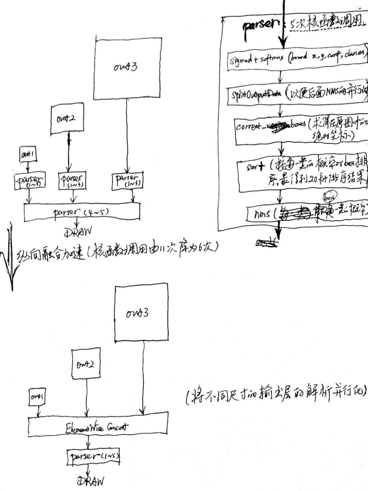

# 前言

## [ASIC 是未来发展方向](https://baijiahao.baidu.com/s?id=1610466874421673569&wfr=spider&for=pc)

因下面两个趋势的消失，通用计算芯片的发展已趋于平缓，专用计算芯片开始进入大众视野：

1. 摩尔定律：当价格不变时，集成电路上可容纳的元器件的数目，约每隔18-24个月便会增加一倍，性能也将提升一倍。
2. [Dennard Scaling](http://www.newsmth.net/nForum/#!article/CSArch/43360) ：晶体管尺寸变小，功耗会同比变小，换句话说相同面积下功耗不变。

## 性能指标

1. 所需计算量（FLOPs, float-point operations, 浮点运算次数）：比如对于 1 * 1 的卷积操作，当输入输出通道数分别为 c1, c2 时，FLOPs = c1 * h * w * c2；
2. 所需带宽量（MAC, memory access cost）：比如对于 1 * 1 的卷积操作，当输入输出通道数分别为 c1, c2 时，MAC = h * w * c1 + c1 * c2 + h * w * c2；
3. 数据吞吐量（Throughput）：单位时间内可以成功传输的数据数量；
4. IOPS：单位时间内系统能处理的I/O请求数量，一般以每秒处理的I/O请求次数为单位，用于衡量磁盘性能；
5. [带宽（band width）：单位时间内可以传输的数据数量，即在传输管道中可以传递数据的能力](https://community.emc.com/docs/DOC-28653)；
   * 带宽为吞吐量的理想值，因为受各种低效率的影响，吞吐量常比带宽低很多
   * 带宽为链路上的可用带宽，只取决于链路时钟和信道编码，吞吐量为实际链路中每秒所能传送的比特数，为实际的测试性能
   * 性能监控工具显示 IOPS 低或者 Throughput 低于预期，先不要直接认为存储性能存在问题，搞清楚应用的 I/O 大小，再做后续判断

# 模型推理

## tensorRT

### 优化

#### layer & tensor fusion

在部署模型推理时，这每一层的运算操作都是由GPU完成的，具体是GPU通过启动不同的CUDA（Compute unified device architecture）核心来完成计算的，CUDA核心计算张量的速度是很快的，但是往往大量的时间是浪费在CUDA核心的启动和对每一层输入/输出张量的读写操作上面，这造成了内存带宽的瓶颈和GPU资源的浪费。

故可通过合并计算图来优化推理：横向合并可以把卷积、偏置和激活层合并成一层CBR(conv+bias+relu)结构，只占用一个CUDA核心；纵向合并可以把结构相同，但是权值不同的层合并成一个更宽的层（多层输出的结构可借用该方法做输出层的解析加速，如下图所示），也只占用一个CUDA核心。



#### [weight & activation precision calibration](<https://arleyzhang.github.io/articles/923e2c40/>)


#### others

* kernel auto-tuning: TensorRT will pick the implementation from a library of kernels that delivers the best performance for the target GPU, input data size, filter size, tensor layout, batch size and other parameters.
* dynamic tensor memory: 在每个tensor的使用期间，TensorRT会为其指定显存，避免显存重复申请，减少内存占用和提高重复使用效率。
* multi-stream execution: Scalable design to process multiple input streams in parallel.

### 使用流程

#### build

build: Import and optimize trained models to generate inference engines.

``` c++
// 创建一个builder
IBuilder* builder = createInferBuilder(logger_);
// 创建一个network对象，不过这时network对象只是一个空架子
INetworkDefinition* network = builder->createNetwork();
ICaffeParser *parser = createCaffeParser();
// 这一步之后network对象里面的参数才被填充，才具有实际的意义
auto blobNameToTensor = parser->parse(deployFile,                                                 modelFile,
                                      *network,
                                      DataType::kFLOAT);
for (auto& s : vOutputBlobNames_)
  network->markOutput(*blobNameToTensor->find(s.c_str()));
// 设置batchsize和工作空间，然后创建inference engine
builder->setMaxBatchSize(maxBatchSize_);
builder->setMaxWorkspaceSize(16 << 20); 
// 调用buildCudaEngine时才会进行前述的层间融合或精度校准优化方式
ICudaEngine* pEngine_ = builder->buildCudaEngine(*network);
network->destroy(); builder->destroy();
```

解析caffe模型之后，必须要指定输出tensor，设置batchsize和工作空间。设置batchsize就跟使用caffe测试是一样的，设置工作空间是进行前述层间融合和张量融合的必要措施。层间融合和张量融合的过程是在调用`builder->buildCudaEngine`时才进行的。

#### deployment

deploy: Generate runtime inference engine for inference.

``` c++
// 创建上下文环境 context，用于启动kernel
IExecutionContext *context = pEngine_->createExecutionContext();
//获取输入，输出tensor索引
int inputIndex = pEngine_->getBindingIndex(inputLayerName),
int outputIndex = pEngine_->getBindingIndex(outLayerName);
// Allocate GPU memory for Input / Output data
void* buffers = malloc(pEngine_->getNbBindings() * sizeof(void*));
cudaMalloc(&buffers[inputIndex], batchSize * size_of_single_input);
cudaMalloc(&buffers[outputIndex], batchSize * size_of_single_output);
//使用cuda 流来管理并行计算
cudaStream_t stream;
cudaStreamCreate(&stream);
//从内存到显存，input是读入内存中的数据；buffers[inputIndex]是显存上的存储区域，用于存放输入数据
cudaMemcpyAsync(buffers[inputIndex], 
                input, 
                batchSize * size_of_single_input, 
                cudaMemcpyHostToDevice, 
                stream);
//启动cuda核计算
context.enqueue(batchSize, buffers, stream, nullptr);
//从显存到内存，buffers[outputIndex]是显存中的存储区，存放模型输出；output是内存中的数据
cudaMemcpyAsync(output, 
                buffers[outputIndex], 
                batchSize * size_of_single_output, 
                cudaMemcpyDeviceToHost, 
                stream));
//如果使用了多个cuda流，需要同步
cudaStreamSynchronize(stream);
cudaStreamDestroy(stream);
cudaFree(buffers[inputIndex]);
cudaFree(buffers[outputIndex]);
```

deploy阶段主要完成推理过程，Kernel Auto-Tuning 和 Dynamic Tensor Memory 应该是在这里完成的。将上面一个步骤中的plan文件首先反序列化，并创建一个 runtime engine，然后就可以输入数据，然后输出分类向量结果或检测结果。